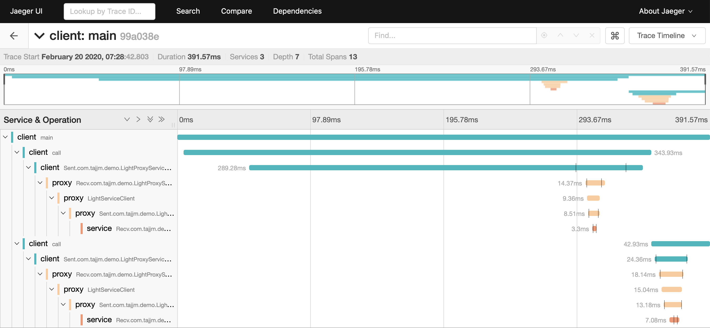
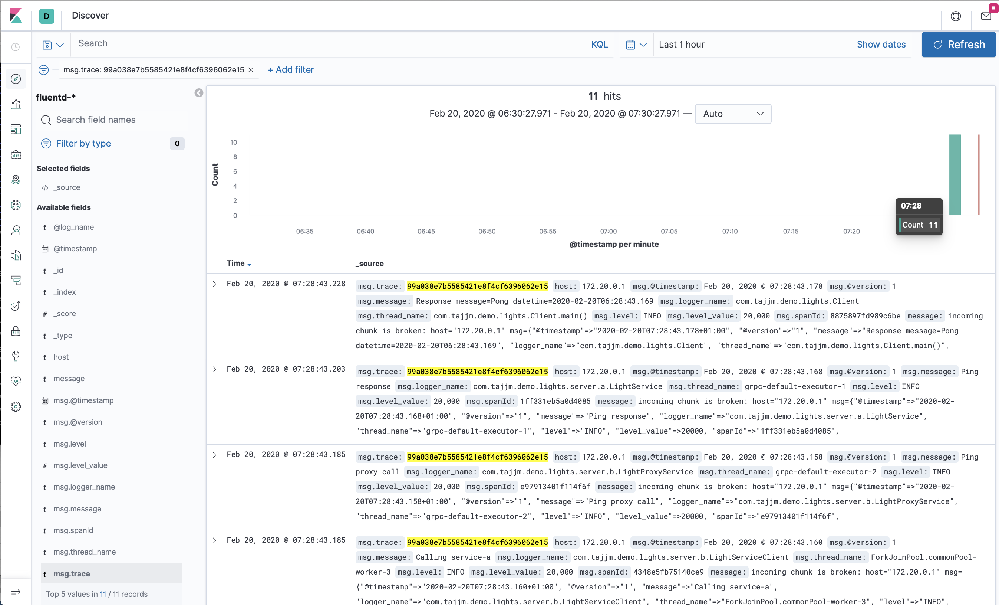

# Demo Project for Distributed Tracing

This is a sample project to show how distributed tracing and log aggregation can be solved.

The demo shows a client which makes two calls to a service B which calls another service A. 
 
Client -> Service B -> Service A

The demo shows how the context is propagate between services and threads, as well as how to use MDC logging to use the tracing to tie the logs together across services for a request.

## Running the demo

### 1. Start jaeger, fluentd, elasticsearch and kibana 

    docker-compose up

### 2. Run service A

    mvn exec:java
    
### 3. Run service B
    
    mvn exec:java
    
### 4. Run client

    mvn exec:java
    
### 5. Check traces in Jaeger UI

[Jaeger UI](http://localhost:16686/search)    

### 6. Check logs in Kibana

[Kibana](http://localhost:5601)
    

    
## Development

### Build the project

    mvn install
    
### To check if something needs to be updated

    mvn versions:display-dependency-updates

### Running jaeger in docker
    
    docker run -d --name jaeger \
      -e COLLECTOR_ZIPKIN_HTTP_PORT=9411 \
      -p 5775:5775/udp \
      -p 6831:6831/udp \
      -p 6832:6832/udp \
      -p 5778:5778 \
      -p 16686:16686 \
      -p 14268:14268 \
      -p 14250:14250 \
      -p 9411:9411 \
      jaegertracing/all-in-one:1.16
      
## TODO

* Containerize the java apps.
* Create the elasticsearch index for fluentd automatically
    