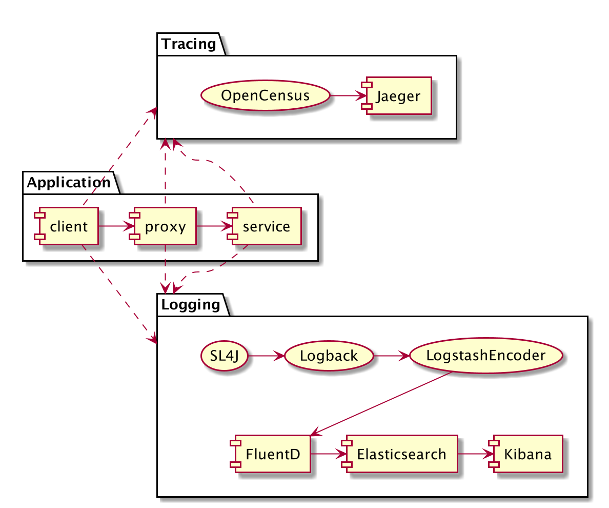

# Demo Project for Distributed Tracing

This is a sample project to show how distributed tracing and log aggregation can be solved.

The demo shows a client which makes two calls to a proxy which calls a service. 
 
 

The demo shows how the context is propagate between services and threads, as well as how to use MDC logging to use the tracing to tie the logs together across services for a request.

Understanding the context; There is a gRPC context which is stored thread local with the request. In the gRPC context the trace id is stored which then needs to be handed over to any thread working which performs downstream work. The Mapped Diagnostic Context (MDC) is used to decorate the logging with request specific information, e.g. the correlation id, and the MDC is also stored thread local.

* java.lang.ThreadLocal - This class provides thread-local variables.
* io.grpc.Context -  A context propagation mechanism which can carry scoped-values across API boundaries and between threads.
* org.slf4j.MDC - Mapped Diagnostic Context decorates the log events.

## Running the demo

### 1. Start jaeger, fluentd, elasticsearch and kibana 

    docker-compose up

### 2. Run service

    cd service
    mvn exec:java
    
### 3. Run proxy
    
    cd proxy
    mvn exec:java
    
### 4. Run client

    cd client
    mvn exec:java
    
### 5. Check traces in Jaeger UI

[Jaeger UI](http://localhost:16686/search)    

### 6. Check logs in Kibana

[Kibana](http://localhost:5601)
    

    
## Development

### Build the project

    mvn install
    
### To check if something needs to be updated

    mvn versions:display-dependency-updates

### Running jaeger in docker
    
    docker run -d --name jaeger \
      -e COLLECTOR_ZIPKIN_HTTP_PORT=9411 \
      -p 5775:5775/udp \
      -p 6831:6831/udp \
      -p 6832:6832/udp \
      -p 5778:5778 \
      -p 16686:16686 \
      -p 14268:14268 \
      -p 14250:14250 \
      -p 9411:9411 \
      jaegertracing/all-in-one:1.16
      
### Inspecting a container

To enter the container and check the manifest for the service jar

    docker run -it --entrypoint "/bin/sh" tajjm/server-a:1.0-SNAPSHOT
    cd app
    jar -xvf service.jar META-INF/MANIFEST.MF && cat META-INF/MANIFEST.MF
      
## TODO

* Containerize the java apps.
* Create the elasticsearch index for fluentd automatically
* Common log config

    